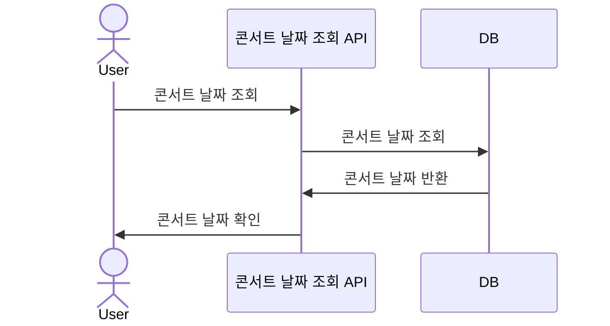
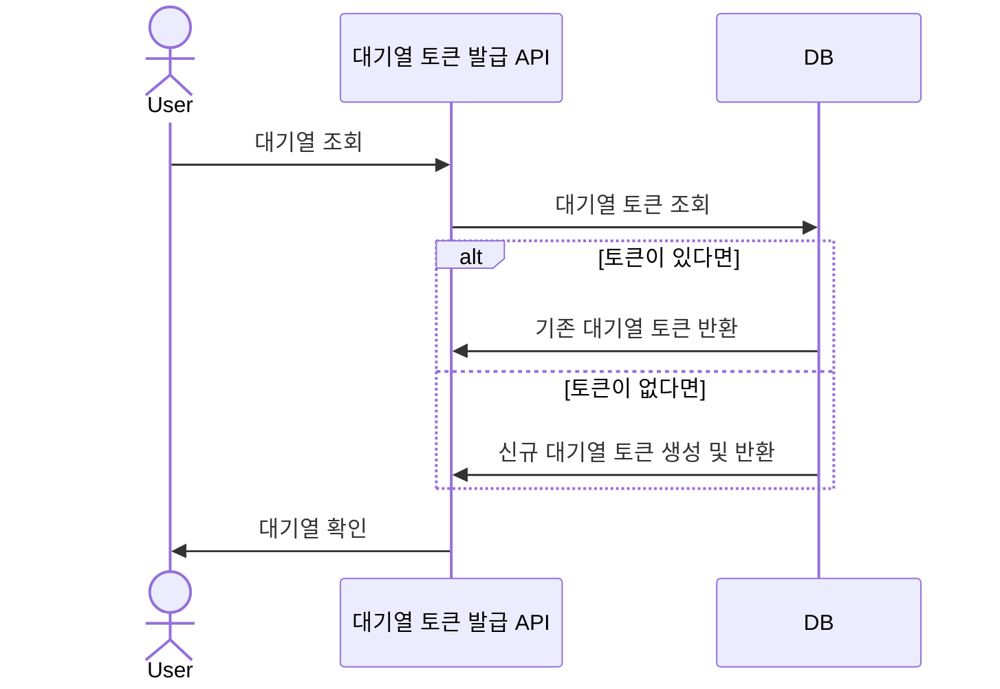
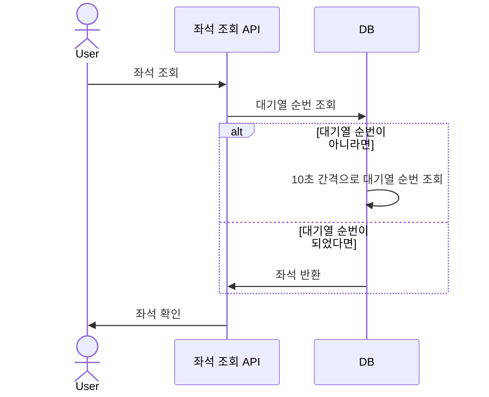
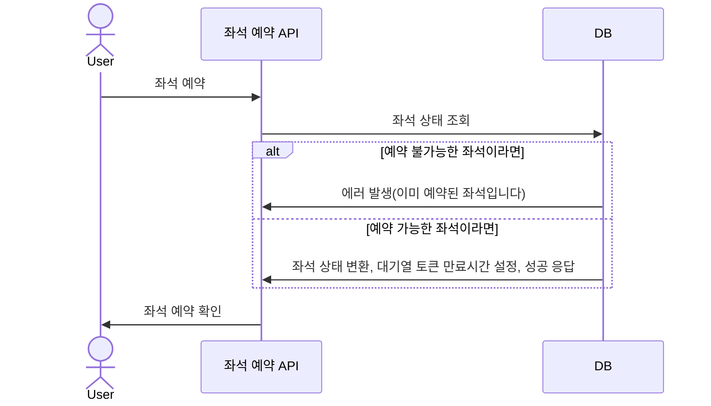
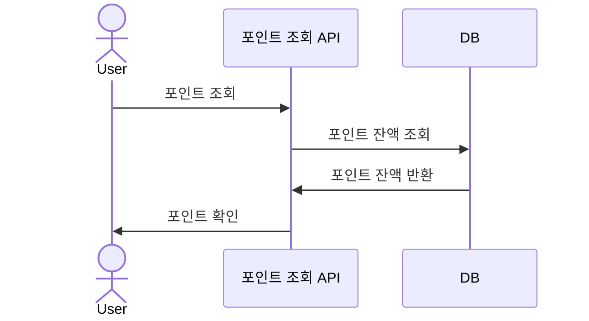
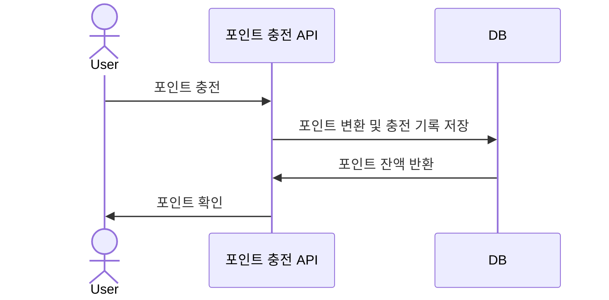
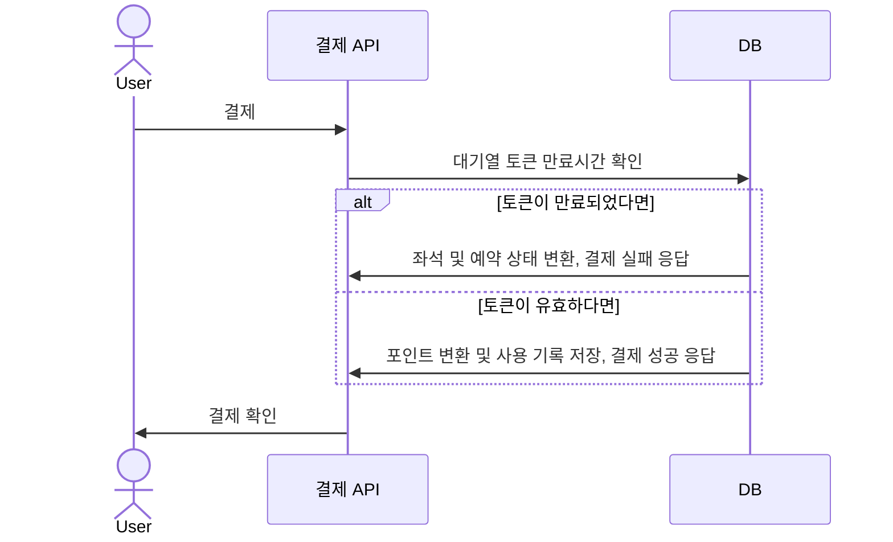

## 동시성 이슈 파악 및 제어 방식 도입

<details>
  <summary>Swagger API 캡처본</summary>


</details>

<details>
  <summary>마일스톤</summary>


일정 산출 이유
- 단위/통합 테스트 or 리팩토링 같은 일정은 기능 개발과 함께 항상 진행된다는 가정하에 항목에서 표현하지 않았습니다.
- 개발 초기에는 db 세팅을 함께 진행하여 일정을 길게 잡았습니다.
- 핵심 API 개발 단계에서는 실패 케이스를 생각하고 길게 잡았습니다.
- 일부 항목은 추후 db erd 설계에 따라 변경/삭제 될 수 있습니다.
</details>

<details>
  <summary>플로우 차트</summary>


- 대기열의 범위를 고민했습니다.   
  콘서트 좌석 예매를 시작하는 첫 단계인 '좌석 조회'에서는 대기열을 확인합니다.   
  그 이후는 고려하지 않고 다른 상태를 확인하도록 설계했습니다.   
  ex) 좌석을 예약할 때는 '좌석을 차지한 상태'를 이용해 예약을 진행했습니다.
</details>

<details>
  <summary>시퀀스 다이어그램</summary>

### 콘서트 날짜 조회


### 대기열 토큰 발급


### 좌석 조회


### 좌석 예약


### 포인트 조회


### 포인트 충전


### 결제

</details>

<details>
  <summary>ERD 설계</summary>


```mysql
CREATE TABLE concert (
    concert_id BIGINT AUTO_INCREMENT PRIMARY KEY,
    concert_name VARCHAR(255),
    concert_date DATETIME NOT NULL
);

CREATE TABLE concert_seat (
    concert_seat_id BIGINT AUTO_INCREMENT PRIMARY KEY,
    concert_id BIGINT,
    seat_number BIGINT,
    seat_status VARCHAR(10),
    FOREIGN KEY (concert_id) REFERENCES concert(concert_id)
);

CREATE TABLE reservation (
    reservation_id BIGINT AUTO_INCREMENT PRIMARY KEY,
    user_id BIGINT,
    concert_seat_id BIGINT,
    reservation_status VARCHAR(10),
    FOREIGN KEY (user_id) REFERENCES user(user_id),
    FOREIGN KEY (concert_seat_id) REFERENCES concert_seat(concert_seat_id)
);

CREATE TABLE user (
    user_id BIGINT AUTO_INCREMENT PRIMARY KEY,
    user_point BIGINT,
    user_name VARCHAR(30)
);

CREATE TABLE user_queue (
    user_queue_id BIGINT AUTO_INCREMENT PRIMARY KEY,
    user_id BIGINT,
    token VARCHAR(255),
    user_queue_status VARCHAR(10),
    expired_at DATETIME,
    FOREIGN KEY (user_id) REFERENCES user(user_id)
);

CREATE TABLE ledger (
    ledger_id BIGINT AUTO_INCREMENT PRIMARY KEY,
    user_id BIGINT,
    transaction_type VARCHAR(10),
    amount BIGINT,
    update_millis DATETIME,
    FOREIGN KEY (user_id) REFERENCES user(user_id)
);

CREATE TABLE payment (
    payment_id BIGINT AUTO_INCREMENT PRIMARY KEY,
    user_id BIGINT,
    reservation_id BIGINT,
    payment_status VARCHAR(10),
    amount BIGINT,
    FOREIGN KEY (user_id) REFERENCES user(user_id),
    FOREIGN KEY (reservation_id) REFERENCES reservation(reservation_id)
);
```
- concert 조회와 날짜 조회를 합쳐 설계했습니다. 콘서트 조회 API가 명세에 없었기 때문
- 좌석(seat)은 번호와 상태를 통해 조회/예약 가능 여부를 파악하게 했습니다.
- 예약(reservation)은 상태를 통해 reserved/canceled를 파악할 수 있습니다.
- 결제(payment)는 상태를 통해 success/fail을 파악할 수 있습니다.
- 사용자(user)는 point를 보유하고 충전/결제 이력은 ledger에 기록하여 무결성 유지가 되게끔 설계했습니다.
- 대기열 토큰은 user_queue로 관리되며 상태를 통해 ready/active를 구분하게 했습니다.

</details>
