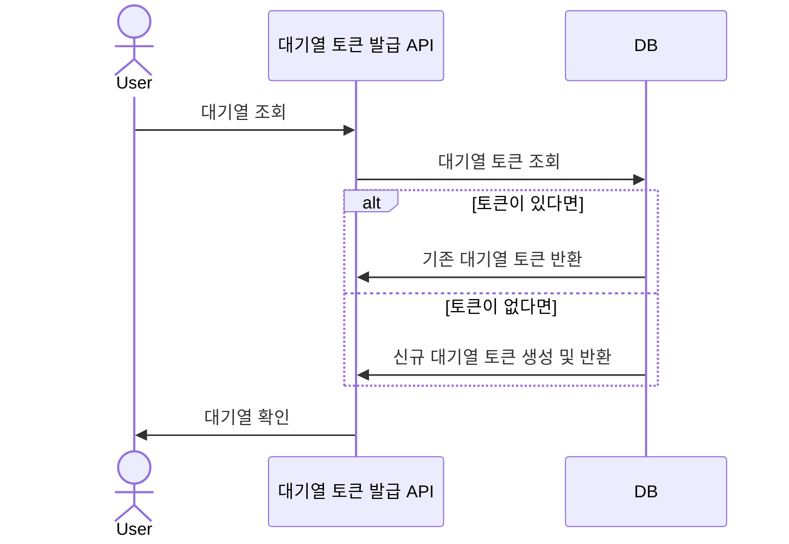
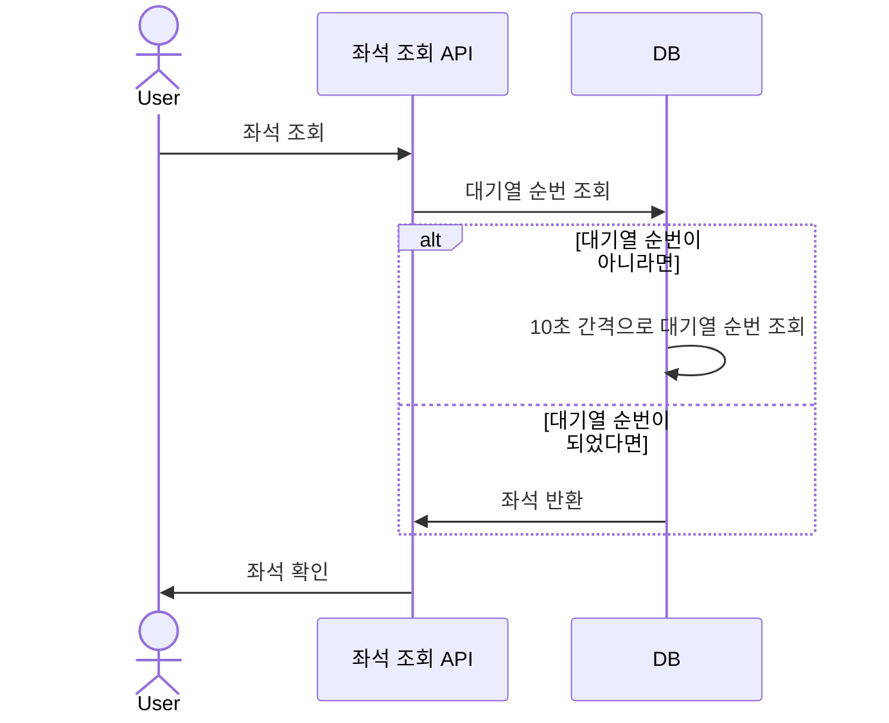
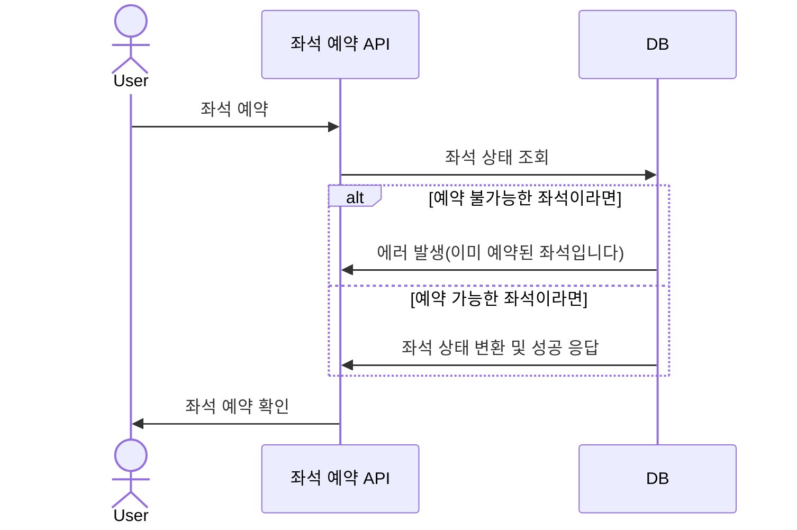
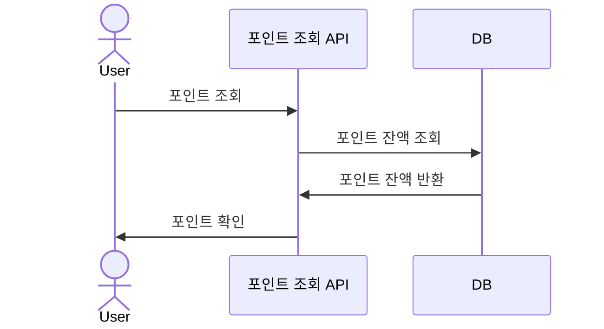
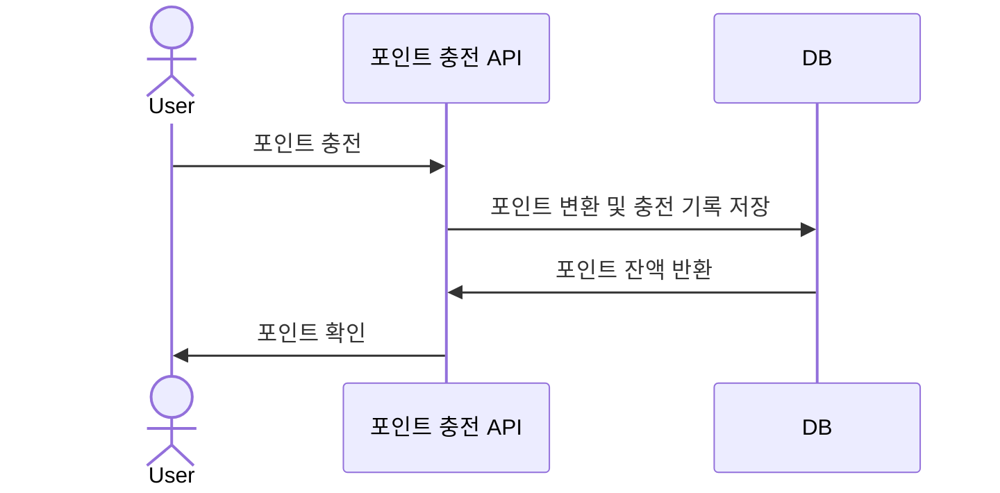
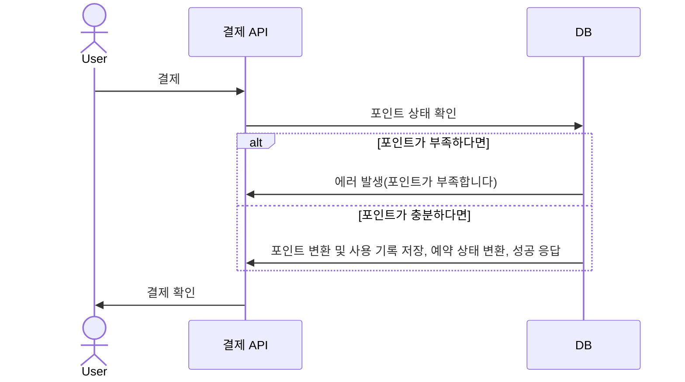

## 마일스톤

---

일정 산출 이유
- 단위/통합 테스트 or 리팩토링 같은 일정은 기능 개발과 함께 항상 진행된다는 가정하에 항목에서 표현하지 않았습니다.
- 개발 초기에는 db 세팅을 함께 진행하여 일정을 길게 잡았습니다.
- 핵심 API 개발 단계에서는 실패 케이스를 생각하고 길게 잡았습니다.
- 일부 항목은 추후 db erd 설계에 따라 변경/삭제 될 수 있습니다. 

## 플로우 차트

---

- 대기열의 범위를 고민했습니다.   
콘서트 좌석 예매를 시작하는 첫 단계인 '좌석 조회'에서는 대기열을 확인합니다.   
그 이후는 고려하지 않고 다른 상태를 확인하도록 설계했습니다.   
ex) 좌석을 예약할 때는 '좌석을 차지한 상태'를 이용해 예약을 진행했습니다.

## 시퀀스 다이어그램

---

### 대기열 토큰 발급

### 좌석 조회

### 좌석 예약

### 포인트 조회

### 포인트 충전

### 결제
