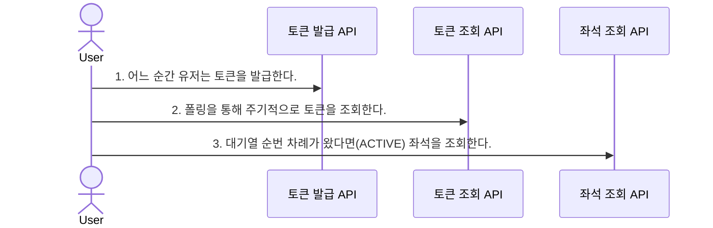
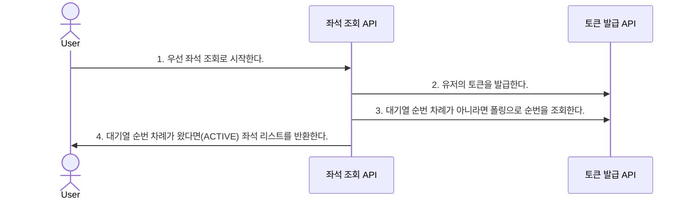

## 그럼 대기열 토큰의 발급은 언제하는가?

---
내가 비즈니스 로직을 구현하면서 처한 상황은 다음과 같다.   

1. 클라이언트 영역의 개발을 하지 않는다.
2. 스케줄링을 구현해야 한다. (허재 코치님) 

문득 '그럼 대기열 토큰의 발급은 언제하는가?'에 대한 고민이 생겼다.   
2가지 시나리오를 떠올렸고 간단한 이해를 위해 '응답값'은 제외시켰습니다.

### 시나리오 1

궁금한점
- 도대체 '어느 순간'은 언제를 의미하는가?
- 스케줄러가 필요한 곳은 보이지 않는다.

### 시나리오 2

궁금한점
- API에서 API로 요청을 보낸다. MSA 환경을 구현하는 건가?
- 아니면 옳다구나! 이곳에서 스케줄러를 구현해 '토큰 API의 비즈니스 로직'을 직접 호출하면 되는 걸까?